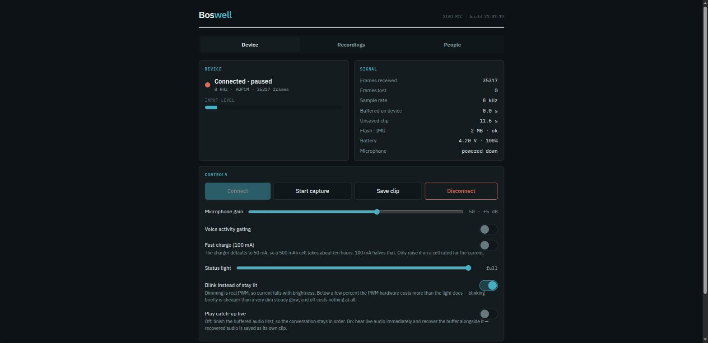
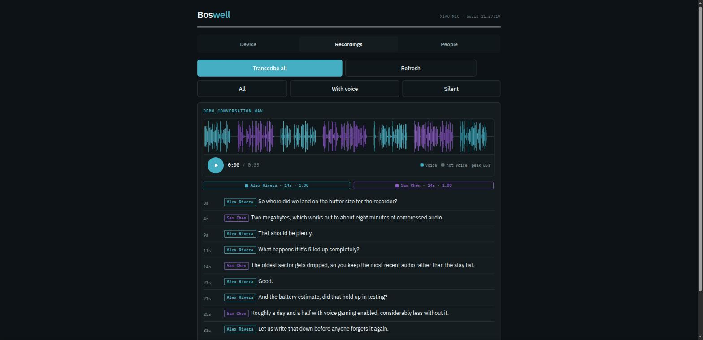
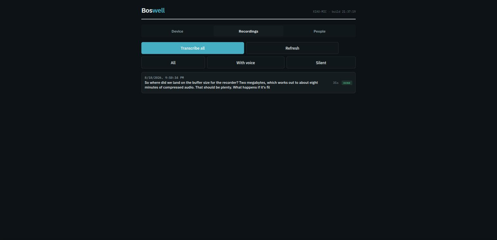
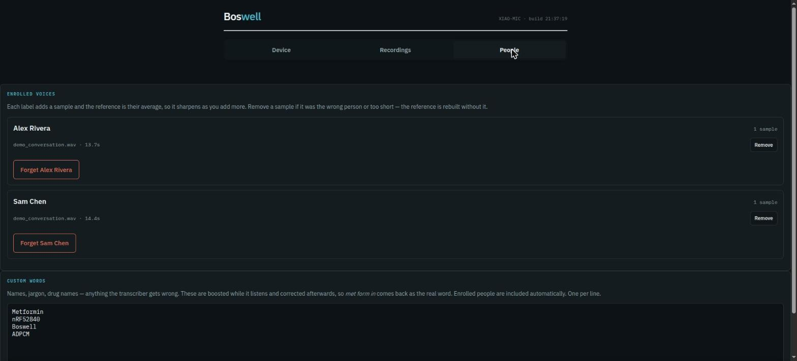

# Boswell

**An open, fully-local wearable that listens, transcribes, knows who is speaking, and acts on what it hears.**

No cloud. No account. No audio ever leaves your machine.

---

## Why "Boswell"

James Boswell spent two decades following Samuel Johnson around London writing
down his conversations verbatim, and published them as *The Life of Samuel
Johnson* — still one of the most detailed records of how any person actually
talked. The word entered English as a common noun: **a Boswell is a devoted
recorder of another's conversation.**

That is precisely what this is. A small device that quietly keeps the record,
so you don't have to.

---

## Running it as a service

The capture service is what turns the device's audio into recordings, so if
it is not running, nothing is recorded no matter how well the device behaves.
Started by hand it goes with the machine: a reboot here once stopped the
recording for three hours before anyone noticed.

    mkdir -p ~/.config/systemd/user
    cp host/boswell.service ~/.config/systemd/user/
    systemctl --user daemon-reload
    systemctl --user enable --now boswell
    sudo loginctl enable-linger $USER     # start without a login

    systemctl --user status boswell
    journalctl --user -u boswell -f

The unit restarts on failure and starts at boot. The device buffers to its
own flash meanwhile, and that backlog survives a reset, so an interruption on
this side costs latency rather than audio.

## The interface



*Connection and capture state, input level, flash backlog, and live controls for
gain, voice gating, charge current and the status light.*



*Each voice gets its own colour in the waveform, so you can see who spoke when
without cutting the conversation apart. Everything that is not speech stays grey.
Playback lives in the waveform: tap anywhere to seek.*

  

*Recordings can be filtered to those with voice or without. Naming a speaker
enrols their voiceprint, and the People tab shows what each one was built from.*

> Screenshots use synthetic speech, not real recordings.

## Status

Working prototype. Every stage below has been run end-to-end on real hardware
with real conversations.

| Stage | Status |
|---|---|
| PDM mic → USB → WAV → transcript | ✅ |
| PDM mic → **BLE** → WAV → transcript | ✅ |
| Mic gain calibration | ✅ |
| On-device VAD (hangover + pre-roll) | ✅ |
| Speaker diarization | ✅ |
| **Named speakers** via voiceprint enrollment | ✅ |
| Local LLM agent with tool calling | ✅ |
| QSPI store-and-forward buffering | ✅ |
| IMU double-tap toggle + RGB status LED | ✅ |
| IMU: pedometer, activity detection | ⬜ planned |
| Responsive web UI | ✅ |
| Phone app | ⬜ planned |

---

## Hardware

| Part | Notes |
|---|---|
| **Seeed XIAO nRF52840 Sense** | nRF52840, 1 MB flash / 256 kB RAM, BLE 5.4 |
| PDM microphone | MSM261D3526H1CPM, on-board |
| 6-axis IMU | LSM6DS3TR-C, on-board |
| 2 MB QSPI flash | P25Q16H, on-board |
| Charger | BQ25101 — **50 mA fast charge**, see notes |
| Host | Any Linux box with a CUDA GPU |
| BLE adapter | Bluetooth 4.0 is sufficient (see measurements) |

Firmware uses **14% of flash and 10% of RAM**, so there is ample room for the
planned features.

---

## Hardware reference

Official documentation: [Seeed wiki](https://wiki.seeedstudio.com/XIAO_BLE/) ·
[datasheet (PDF)](https://files.seeedstudio.com/Bazaar/product_pdf/102010469.pdf)

Pin assignments this firmware depends on, from the board's Arduino variant:

| Function | Arduino pin | nRF52840 | Notes |
|---|---|---|---|
| PDM power | D19 | P1.10 | |
| PDM clock | D20 | P1.00 | |
| PDM data | D21 | P0.16 | |
| IMU power | D15 | **P1.08** | **must be H0H1 high drive** |
| IMU I²C SCL | D16 | P0.27 | dedicated bus, not the D4/D5 header |
| IMU I²C SDA | D17 | P0.07 | |
| IMU INT1 | D18 | P0.11 | double-tap interrupt |
| LED red / green / blue | D11 / D13 / D12 | P0.26 / P0.30 / P0.06 | active low |
| Battery sense enable | D14 | P0.14 | drive **low** to read |
| Battery voltage | — | P0.31 | 1M/510k divider |
| Charge current select | D22 | P0.13 | low = 100 mA, float = 50 mA |
| Charge status | D23 | P0.17 | active low, **not named in the variant** |
| QSPI flash | D24–D27 | P0.21/25/20/24 | P25Q16H, 2 MB |

### Things the documentation does not tell you

**The IMU will not power up on a normal output pin.** Its supply is P1.08 and
the pin must be configured `H0H1` high drive. Standard drive cannot source
enough current, so the sensor never starts and every I²C probe reads `0xFF`,
which looks exactly like a wiring fault.

**The IMU is on its own I²C bus** (P0.27/P0.07), not the D4/D5 header pins. The
board's own library papers over this with `#define Wire Wire1`.

**The nRF52 core's I²C blocks forever.** Its TWIM driver spins on hardware
events with no timeout, so one unresponsive device wedges the main loop while
Bluetooth keeps advertising — the board looks alive and has silently stopped
recording. This firmware bit-bangs I²C instead, where every loop is bounded.

**Rate-limit sensor polling by wall clock, not loop iterations.** A poll written
as "every fourth pass through `loop()`" becomes hundreds of transactions per
second once the loop is spinning on audio. That was enough here to drown the
IMU's own tap interrupt and, with one more poller added, to crash the firmware
at boot.

**`PDM.begin()` resets microphone gain.** It calls `setGain(20)` internally, so
gain set beforehand is silently discarded. Always set it afterwards.

**The QSPI part is not in the flash-device table.** Every Seeed nRF52 variant
names `P25Q16H` but `Adafruit_SPIFlash` has no entry for it, so it must be
declared by hand (see `firmware/ble_mic/qspi_store.h`).

**Charging defaults to 50 mA**, which is about ten hours for a 500 mAh cell.
The BQ25101's HICHG pin selects 100 mA.

## Architecture

```
XIAO nRF52840 Sense
  PDM mic 16 kHz
    → 2:1 decimate (optional)      8 kHz
    → energy VAD + 300 ms hangover + 60 ms pre-roll
    → IMA ADPCM 4:1
    → BLE GATT notify              ~32 kbps
                │
                ▼
Host (Linux + CUDA)
    → ADPCM decode → WAV
    → level normalise              never attenuates, capped at 30 dB
    → WhisperX large-v3            transcript + word timestamps
    → AST / AudioSet               527 sound classes, in 5 s windows
    → pyannote diarization         SPEAKER_00 / SPEAKER_01
    → voiceprint match             → real names
    → chunk on pauses & turns
    → local LLM (tool calling)     → notes / tasks / events / facts
```

### What else is in the audio

Every clip goes through a second model — AST, fine-tuned on AudioSet — that
names what it hears from 527 everyday classes. It is not a speech model and
does not care whether anyone spoke, which is the point: it is the only thing
that can tell an empty room from a dog.

It listens in **ten-second windows overlapping by half** — five passes over a
thirty-second clip — not to the whole clip at once, and the width is not a
preference.

**AST truncates at 10.24 seconds.** `ASTFeatureExtractor` has `max_length`
1024 frames at a 10 ms hop, and anything longer is cut rather than summarised.
It fails silently: it returns a confident verdict on the part it kept. So the
original whole-clip tagging never looked at a whole clip — it judged thirty
seconds by their first ten and threw the rest away.

    feature shape, whole 30 s clip    (1, 1024, 128)
    feature shape, first 10.24 s      (1, 1024, 128)
    whole-clip verdict == first 10.24 s?   True

                         whole    first 10.24s   last 10.24s
    Dog                  0.009        0.009         0.564
    Mechanical fan       0.109        0.109         0.003

Which is why a bark eight seconds from the end scored 0.009, and why two
thirds of this archive had never been listened to at all. Ten seconds at a
five-second hop covers `[0–10]` through `[20–30]` with every second inside two
windows and nothing truncated; fifteen-second windows would be silently cut to
10.24 and leave the last five seconds of every clip unheard. A short event inside a long recording is invisible to a single
verdict over thirty seconds, and the difference is not marginal:

| | whole clip | windowed |
|---|---|---|
| Dog, on a clip of someone talking while dogs barked | 0.009 | **0.559** |
| Bark | 0.031 | 0.347 |
| Throat clearing | 0.112 | 0.731 |

The control is the neighbouring clip where the same person says "so you dogs"
and no dog makes a sound: it stays at 0.001. It finds the bark, not the word.

The whole-clip score is kept and the stronger of the two wins, because a
*constant* sound loses by being chopped up exactly as a brief one loses by
being averaged — windowing alone dropped a fan from 0.109 to 0.083.

A window-only find must appear in **two** windows. Best-of-N gives noise N
chances to cross a threshold and it takes them.

Ten seconds rather than five, measured over 20 clips known to hold a dog and
96 that do not:

| windows | dogs found | phantom heartbeats | ms/clip |
|---|---|---|---|
| whole clip (1) | 4/20 | 0 | 24 |
| 10s / 10s (3) | 8/20 | 0 | 38 |
| **10s / 5s (5)** | **9/20** | **0** | **68** |
| 5s / 2.5s (11) | 8/20 | 4 | 156 |

Narrower was not more sensitive, only noisier: a bark is loud enough to carry
a ten-second window, and the extra passes bought nothing but chances to be
wrong. 68 ms a clip is 0.7% of what transcribing the same clip costs.

What it is used for: finding things (`Recordings` has a sound filter, `Heard`
lists everything that was not speech or room noise, rarest first, with a player
on each), knowing a silent clip held a voice, and deciding what is safe to
delete. Tags can be marked wrong on a clip — the correction survives
re-transcription and reaches every view, including the one that decides
deletability.

Two bars, because browsing and searching want different ones. A tag is
searchable at 0.20 and browsable at 0.35: 624 clips carry Vehicle and four of
them clear 0.35, the rest being this machine's fan mistaken for a distant
engine. A filter is a question and can afford the low bar; a list of "what is
in this archive" is a claim and cannot.

Its limits, measured. It misses a quiet laugh entirely — 0.000 in every
window, on a clip whose owner confirms he laughed. That is probably about
capture rather than capability: the same model finds sighs on this hardware at
0.46 to 0.82, and a sigh is no louder than a laugh. Worth re-checking after
anything that improves what reaches the microphone. It hedges across
neighbouring classes rather than committing (Dog, Animal and Domestic animals
within 0.16 of each other). It describes a window rather than an instant. And
it keeps finding this room's fan and naming it something else.

Three times now, each cured and each replaced by the next. At five-second
windows it heard a body: 75 clips with a heartbeat, 70 of those also Hum, 65
Throbbing, 43 Heart murmur. Widening to ten seconds cured that — one clip left
— and produced 218 clips of Vehicle at 0.35+, 189 also Aircraft, nine with any
speech, the most confident at 00:55 and 05:45. Played back they are rushing
air; the device's owner said it "did sound a bit like an aircraft engine close
up", which is the whole difficulty: the model is not being stupid, a fan
blowing into a microphone genuinely resembles a prop engine. It is simply
useless for finding things, which is the only thing the tags are for.

Where it is reliable, checked the same way — played to the person who was
there, across the confidence range rather than at the top of it, with the
weakest clip above the bar always included because that is the one that says
whether the bar is in the right place.

| label | sampled | weakest tested | verdict |
|---|---|---|---|
| Dog | 4 of 26 | 0.37 | 4/4 real; two were whining, not barking |
| Typing | 4 of 251 | 0.35 | 4/4 real, including one with a 0.53 fan reading |
| Music | 4 of 46 | 0.35 | 3/4 clearly music; the fourth was video audio he did not call music |
| Sigh | 4 of 7 | 0.46 | 3/4 real sighs; the fourth was a throat clearing with distortion |
| Arrow | 2 of 5 | 0.67 | 0/2 — a television, and the fan |
| Patter | 2 of 5 | 0.56 | 0/2 — the fan, both times |
| Typewriter | 2 of 5 | 0.71 | 2/2 real, and neither is a typewriter: it is the dog's claws on lino |

**14 of 16 on the four common labels**, spread deliberately across the
confidence range rather than taken from the top of it, so it says the 0.35 bar
is in a sensible place — not that the error rate is 12%.

The bottom six were sampled precisely because they looked wrong, and were:
0 of 6 by name. Two kinds of wrong, needing different handling. Arrow and
Patter were a television and the fan, so they join the other fan costumes in
the hidden list. Typewriter was real both times and is not a typewriter — it
is a dog's claws on kitchen lino. Suppressing that would throw away a true
signal about the room; leaving it alone would put a typewriter in a house that
has none. The label stays, since it is what the model said and what the filter
searches, and what it actually is travels beside it, through the interface and
through the MCP.

So 0.35 holds, with Music the softest of the three — a video playing is a
plausible thing to hear music in and a plausible thing to be wrong about, and
it is shown rather than hidden, so an error there costs attention rather than
recordings.

The stored time is worth something too, which was checked because it looked
like it might not be. Per window on a clip whose music the listener placed at
the start of what he was played: 0.033, 0.013, 0.357, 0.403, 0.017 across the
five windows. The music really is absent from the first ten seconds and
present from ten to twenty-five, and the peak is a peak rather than the
argmax of five similar numbers. Two of these settle something the dog case could not. The typing clip with the
strongest fan reading of its four was real typing, and the sigh clip picked out
as most likely to be the fan — Mechanical fan and Hum alongside, a transcript
of just "Hmm." — was a real sigh. So "a fan is present, doubt the tag" is not a
usable rule. The fan produces its own labels rather than corrupting other ones,
which is exactly why the suppression list names classes instead of discounting
anything heard beside a fan.

That is the shape of this model on this hardware. It is trustworthy about
events that happen — a bark, a whine, a microwave, a cupboard — and unreliable
about featureless continuous noise, which it will name something rather than
nothing. The suppression list is not a list of the model's mistakes in
general; it is a list of what one fan sounds like to it.

Both clusters are hidden from the browsing list and left searchable, so a real
car is still findable by asking for it. What they must not do is fill a page
titled "what is in this archive" with something that never happened.

### What the status light means

The colours answer the question you actually ask across a room — *am I
recording?* — before the one you ask second. Every bright colour means yes.

**Recording**

| colour | meaning |
|---|---|
| green | everything is reaching the computer |
| cyan | live, and sending buffered audio alongside it |
| magenta | no computer — saving to flash to send later |

**Not recording**

| colour | meaning |
|---|---|
| red | connected, paused |
| blue | waiting to be found |

**Something is wrong**

| colour | meaning |
|---|---|
| yellow | recording, but the flash chip is not available. Anything the radio cannot carry is lost rather than buffered. |
| white | armed, but the microphone is producing nothing. The PDM driver can wedge and report every read empty forever while every flag still says it is capturing; the firmware rebuilds the stream, and shows this if that did not work. |

Each is one steady colour, or in pulse mode that same colour flashed briefly —
never a pattern to count. They are named constants in `ble_mic.ino`
(`LED_RECORDING`, `LED_BUFFERING`, …) rather than bare triples at each call
site, so this table has one source.

Yellow was added after noticing that a device whose QSPI never initialised
showed plain green: healthy in every visible way, until the disconnection that
turned the fault into lost recordings.

### Frame format

Each BLE frame carries **its own ADPCM predictor state**:

```
[seq:u16][flags:u8][stepIndex:u8][predictor:i16][nsamples:u16][nibbles...]
```

Standard ADPCM shares encoder state across the whole stream, so a single lost
packet desynchronises the decoder permanently. Over a radio link that is fatal.
Self-contained blocks cost 8 bytes per frame and make packet loss cost exactly
one frame.

---

## Measured performance

Real numbers from real runs, not estimates.

| Metric | Value |
|---|---|
| Over-the-air bitrate | **35.2 kbps** (8 kHz ADPCM) |
| Frame loss, Bluetooth **4.0** dongle | **0.00%** over 1501 frames |
| VAD airtime reduction | **52.9%** → 15.9 kbps average |
| Transcription speed | ~20× realtime, Whisper large-v3 on an RTX 4090 |
| Same-speaker embedding similarity | 0.65 – 0.87 |
| Flash backlog drain rate | **~4.3× realtime** |
| Offline buffer capacity | ~7.7 min continuous, more with VAD |
| Different-speaker similarity | 0.38 – 0.48 |

**8 kHz ADPCM at 32 kbps is enough for accurate transcription.** This was the
open design question, and it means Opus is an optimisation for battery life
rather than a requirement — a large amount of firmware complexity avoided.

A Bluetooth 5.x adapter is *not* required. It buys headroom for 16 kHz (64 kbps)
and eventual Opus, but a cheap BT 4.0 dongle dropped nothing.

---

## Store-and-forward

Capture is *armed*, not *connected*. When the host goes away the device keeps
recording into the onboard 2 MB flash, and drains the backlog on reconnect
before resuming live audio, so the conversation arrives in order rather than
with a hole in it.

Measured over a 20-second outage: 90,990 bytes buffered (20.2 s of audio),
drained in 4.7 s. The recovered audio is statistically indistinguishable from
live audio.

Records are `[0xB5][len][payload]` in a circular byte stream. The magic byte
matters: when the writer laps the reader the oldest sector is dropped, which
can leave the read pointer mid-record, and scanning for the magic recovers the
stream instead of emitting garbage.

When a host reconnects to a backlog you choose what happens, from the Device
tab:

- **Drain first** (default) — finish the buffered audio before any live audio,
  so the conversation reaches you in order. Live capture waits, which on a long
  outage means a real delay before you hear the present.
- **Play catch-up live** — live audio starts immediately and one buffered frame
  is sent alongside each live frame, so the backlog empties at roughly realtime
  without ever starving the live stream. Recovered frames are flagged and saved
  as their own `recovered_*.wav`, since they belong to an earlier moment and
  splicing them into live audio would produce a recording of something that
  never happened.
- **Discard buffer** — throw the backlog away and go live at once.

Measured in catch-up mode: live audio advanced 5.0 s → 9.5 s of wall clock while
recovered audio advanced 1.0 s → 5.2 s and the backlog fell 76.1 s → 72.1 s.

Buffering to flash means erasing a 4 kB sector roughly every 0.9 seconds of
audio, and a NOR erase blocks the CPU for tens of milliseconds — up to 300 ms
on this part. The microphone keeps producing samples throughout, so the ring
buffer has to absorb a whole erase or it overruns, and dropped samples are
audible as a click. At 256 ms of headroom it could not: buffered recordings
carried 681 discontinuities spaced a mean of 0.93 s apart, against a predicted
erase period of 0.91 s. The ring is now 16384 samples, just over a second, and
the same test measures zero.

The status LED reports where audio is going: blue advertising, **magenta
buffering to flash**, cyan draining the backlog, green streaming live, red
connected but disarmed.

## Named speakers

Diarization only produces per-file labels — `SPEAKER_00` in one recording is
not the same person as `SPEAKER_00` in another. Boswell maps those to real
people by cosine-matching 256-dim voiceprints against an enrollment database.

**There is no training step, and no average.** Every label is kept as its own
voiceprint and matching takes the closest single one. Averaging a person into a
centroid was the previous design and it was wrong: the same voice in a quiet
room and outdoors are genuinely far apart in embedding space, and a mean of the
two matches neither well. A person accumulates a reference per condition
instead, and any one of them is enough to recognise them in that condition.

**Identity does not survive the night.** Measured across eleven days of labelled
references: the same voice scores about 0.86 against itself within the hour and
about 0.5 a day later, while two different people under matched conditions reach
0.57 at the 99th percentile. Those overlap, so no threshold accepts a voice
across days without also accepting strangers. A second embedder trained on
different data falls the same way on the same audio, so this is a property of
the speech or the capture path rather than of the model.

That is why the **People** tab has a labelling queue and a "since yesterday"
view. Recognising somebody tomorrow means having a reference from tomorrow, so
the system converges by a couple of minutes a day rather than by better
matching. See `tools_speaker_diag/drift.py` and `embedders.py`.

Most of that work happens without being asked. Conversations are re-diarized
once they have been quiet for 150 s, which pools a voiceprint over minutes of
speech instead of one clip's thirty seconds; unnamed voices are then re-tested
against everyone already known, so a voice named this morning claims this
afternoon's recording of the same person by itself. Naming one cluster attached
768 clips in one pass here.

Voices off a screen are tagged `media` rather than deleted. Their transcripts
stay searchable -- half the point of recording a day is finding the video you
half-remember -- and they stop competing to be somebody, which is how a YouTube
narrator once spent weeks filed under a real name. They are also the only
cross-condition reference data in the archive, which is worth keeping.

---

## Two firmwares, one protocol

`firmware/ble_mic/` is the **Arduino** build: complete, supported, and what to
flash first. `arduino-cli` and a core install is minutes of setup.

`firmware/zephyr/` is the **Zephyr / nRF Connect SDK** build, where new work
happens — it needs a multi-gigabyte SDK and toolchain, which is a real barrier
if you only want a working device.

They share `proto.h` and `ima_adpcm.h`: the same service UUIDs, the same
12-byte frame header, the same codec. **The host cannot tell which one is
running**, so every host tool works against either without changes. That shared
contract is what keeps two firmwares from drifting into two projects.

Zephyr is where Opus belongs — see the note on Omi below — and it gets several
things right that had to be discovered by hand under Arduino. The IMU's
high-drive supply requirement, for instance, is simply declared in the board's
devicetree:

```dts
lsm6ds3tr-c-en {
    enable-gpios = <&gpio1 8 (NRF_GPIO_DRIVE_S0H1 | GPIO_ACTIVE_HIGH)>;
    regulator-boot-on;
    startup-delay-us = <3000>;
};
```

```bash
firmware/zephyr/build.sh            # build
firmware/zephyr/build.sh --flash    # build and flash
```

## Quick start

```bash
# 1. environment (uv)
uv venv --python 3.11 .venv
uv pip install numpy scipy pyserial bleak soundfile requests intelhex
uv pip install fastapi "uvicorn[standard]"
uv pip install torch torchaudio --index-url https://download.pytorch.org/whl/cu128
uv pip install whisperx

# 2. firmware
arduino-cli core install Seeeduino:nrf52
arduino-cli compile --fqbn Seeeduino:nrf52:xiaonRF52840Sense \
    --output-dir build_ble firmware/ble_mic
adafruit-nrfutil dfu serial -pkg build_ble/ble_mic.ino.zip \
    -p /dev/ttyACM0 -b 115200 --singlebank

# 3. capture over BLE
uv run host/ble_capture.py --scan
uv run host/ble_capture.py --seconds 30 --out data/voice.wav

# 4. transcribe + diarize
export HF_TOKEN=hf_...
uv run host/transcribe.py data/voice.wav --diarize \
    --save-embeddings data/spk_voice.npz

# 5. agent
ollama serve &
uv run host/agent.py data/voice.wav
```

### Web UI

```bash
uv run web/server.py     # then open http://localhost:8000
```

A local service that owns the Bluetooth link and serves the interface. It
connects to the board on startup, so a restart resumes capture without
intervention.

**Device** — connection and capture state, input level, and the device's flash
backlog with drain progress. Microphone gain and VAD are adjustable live over
GATT, no reflash.

**Recordings** — grouped into conversations by default, because a 30-second
clip is a storage unit and not a human one. Contiguous clips are gathered and a
gap longer than five minutes starts a new conversation, so the list reads as
"11:00, 2.5 minutes, Nathan and Blase" rather than as five fragments. Flat and
by-day views are also available.

Search runs over **every segment** on the server and returns the matching lines
with timestamps, so a word spoken thirty seconds into a conversation is
findable. It previously matched a 180-character preview, which looked like
full-text search and was not.

Any selection, or a whole conversation, can be exported as plain text; single
clips also export as JSON or SRT.

Every clip, newest first, with a preview of what was said.
Clips are written every 30 seconds and transcribed automatically; nothing needs
a tap per clip.

Filter by content (all, with voice, silent) and by date (any time, today, last
seven days, older). **Select** turns on multi-select for deleting in bulk, with
*Select all shown* respecting whichever filters are active — so "delete every
silent clip older than a week" is three taps. Deleting recordings never touches
enrolled voices; those live in their own files.

Opening a clip gives you:

- a **waveform coloured by speaker** — each voice a different colour, everything
  that is not speech grey. Colour comes from the transcript, never from
  loudness, so a slammed door stays grey.
- **playback in the waveform itself** — play/pause, elapsed and total time, and
  tapping the waveform seeks there.
- the **transcript**, tinted to match, with clickable timestamps.
- **speaker chips** showing who spoke, for how long, and the match confidence.
  Tapping one names that voice.
- **split by voice**, which writes one single-voice clip per speaker. The
  original is untouched; the splits exist because a voiceprint taken from one
  person alone is much stronger than one taken from overlapping speech.
- **delete**, which also removes the transcript and cached waveform.

All device state and every action cross a single WebSocket as JSON.

### Remote access

The web UI is unauthenticated by default, which is fine on a trusted LAN.
Before exposing it anywhere else, set a token — every endpoint can arm the
microphone or hand over recordings:

```bash
export BOSWELL_TOKEN=$(python3 -c "import secrets;print(secrets.token_urlsafe(24))")
uv run web/server.py
```

The page then asks for the token once and remembers it. HTTP and WebSocket
are both gated; only the page shell and its assets stay public so the prompt
can render.

A token is not a substitute for a private network. Prefer **Tailscale or
WireGuard**, where the device is reachable as if it were at home and nothing
is published; a tunnel like ngrok puts a microphone control API on the public
internet, and tunnel URLs get scanned within hours of being created.

### Tuning

```bash
uv run host/tune_gain.py --seconds 4          # sweep mic gain, find levels
uv run host/analyze_vad.py data/sample.wav    # derive a VAD threshold
```

---

## Gotchas worth knowing

Things that cost real debugging time, documented so they don't cost you any.

**`PDM.begin()` silently resets mic gain.** The Arduino PDM library calls
`setGain(DEFAULT_PDM_GAIN)` *inside* `begin()`. The stock `PDMSerialPlotter`
example — which everyone copies — sets gain before `begin()`, so it is
overwritten and has no effect. **Always call `setGain()` after `begin()`.**
This cost us 10 dB of signal and badly degraded speaker embeddings while
leaving transcripts looking deceptively fine.

**Poor SNR wrecks speaker ID long before it wrecks transcription.** A recording
at −10 dB transcribed perfectly but failed to match its own speaker (0.49 vs
0.87 for a correctly-levelled recording). If speaker identity matters, get the
levels right.

**pyannote.audio 4.x ignores which pipeline you request.** Even when you ask
for `speaker-diarization-3.1`, it downloads assets from
`pyannote/speaker-diarization-community-1`, which is gated *separately*. You
must accept that repo too.

**Check HuggingFace access with file downloads, not the model API.**
`GET /api/models/<repo>` returns 200 for gated repos you can merely see. Use
`GET /<repo>/resolve/main/config.yaml` instead.

**whisperx `DiarizationPipeline` takes `token=`**, not `use_auth_token=`, and
its `__call__` accepts `return_embeddings=True` — so no separate embedding
model is needed for enrollment.

**Speech/silence separation in a normal room is only ~9 dB.** A bare energy
threshold chops word onsets, because quiet consonants (`f`, `s`, `th`) fall
below it. Hangover plus pre-roll is what makes energy VAD usable. Mounting the
mic at the collar rather than on a desk is worth 10–15 dB and helps far more
than any code change.

**Rate-limit sensor polling by wall clock, never by loop iterations.** A poll
written as "every 4th pass through `loop()`" became several hundred bit-banged
I2C transactions per second once the loop was spinning freely on audio. That
was enough to drown the LSM6DS3's own tap interrupt — taps were never seen —
and adding one more poller on top pushed the firmware into crashing at boot,
where the bootloader caught it and the board went completely dark. Polling on a
50 ms timer fixed both symptoms at once. The latched interrupt (`LIR`) means a
slow poll cannot miss an event.

**The IMU supply pin needs high drive.** It is P1.08 and must be configured
`H0H1`; a plain `pinMode(OUTPUT)` cannot source enough current, so the sensor
never starts and every I2C probe reads `0xFF`. Nothing in the board variant
header hints at this.

**Tap detection needs the board free to move, not held still.** A device lying
flat on a desk barely registers taps on its face -- the desk absorbs the
impulse and the accelerometer sees very little. The same taps delivered to the
side, or with the board held loosely, trigger reliably. Worn in a case this is
a non-issue, but it makes a desk the worst possible place to test, and it is
easy to misread as a broken configuration.

Default tap threshold is 3 (~187 mg). It can be changed live over the control
characteristic (`0x07 <n>`) without reflashing, so it is worth dialling in on
the finished enclosure rather than on bare hardware. Going much lower risks a
bump toggling capture off while worn, which fails silently.

**The 50 mA charge limit is the BQ25101, not the battery.** If your enclosure
has room, charge through an external charger rather than the on-board one.

---

## Privacy and consent

Boswell records conversations continuously. That is the point, and it carries
real responsibility.

- **All processing is local.** Audio, transcripts, and voiceprints never leave
  your machine. There is no telemetry and no account.
- **Recording other people is regulated.** Many US states and most of the EU
  require the consent of *all* parties. Laws vary by jurisdiction and this is
  not legal advice — know the rules where you are.
- **Voiceprints are biometric data.** The enrollment database identifies
  specific individuals. Treat it accordingly, and note that biometric data is
  specially regulated in many places.
- **`data/` is gitignored by default** and should stay that way. It will
  contain recordings and voiceprints of people who did not choose to be in
  your repository.
- **Build in a hardware mute.** A physical switch that cuts power to the
  microphone is the only mute anyone should have to trust.

---

## Storage

Audio, transcripts, voiceprints and agent output are plain files under `data/`.
They are the source of truth and are meant to be readable, movable and
deletable with ordinary tools.

`data/index.db` is a SQLite index over those files, with an FTS5 table for
search. It is derived, never authoritative: delete it and it rebuilds on the
next start. It exists because listing recordings used to open and parse every
transcript on disk on every request — fine at ten clips, untenable at a few
thousand, which is about a week of continuous use.

## Naming voices

Diarization gives per-file labels (`SPEAKER_00`) that mean nothing across
recordings. Tapping a speaker chip attaches a name, and every later clip
resolves that voice on its own.

Enrolment is a running mean in embedding space, not training: no model is ever
retrained, and what improves is the reference vector each new voice is compared
against. It works from the first sample, sharpens with each label, and costs no
GPU time.

Because the reference is an average, a bad sample degrades it, so two checks
run before anything is enrolled:

- **Length.** Under 5 seconds of a voice in a clip is refused. Short speech
  makes an unreliable embedding, and a bad reference is permanent.
- **Purity.** A diarizer slot whose own turns disagree with each other is
  refused for automatic enrolment. It is usually two people run together, and a
  voiceprint pooled from two voices is indistinguishable from a real one
  afterwards -- right length, right neighbours, quietly wrong forever. Naming
  one by hand still works, because a person listening can hear what the model
  cannot.

There is deliberately **no resemblance check**. The previous design refused any
sample scoring below 0.55 against the person already enrolled, which rejected
exactly the different-room, different-day samples this store exists to collect.
A sample that resembles nothing already held is the valuable one.

Every reference is kept individually, so the **People** tab lists them, groups
the ones that arrived together from naming a voice, and can put a whole group
back if the name was wrong.

Coverage matters more than quantity. The thresholds are derived rather than
guessed -- 1642 same-speaker and 2141 different-speaker pairs, harvested from
diarized conversations where conditions are held constant:

| | median | p10 / p99 |
|---|--:|--:|
| same person, matched conditions | 0.863 | p10 0.715 |
| different people, same recording | 0.107 | p99 0.572 |

A separation of 0.76, not the 0.16 an earlier three-pair measurement suggested.

A name is applied when a person clears 0.75 and beats the next *person* -- not
the next reference, since a well-covered person owns several of those -- by
0.15. Or when the winner is simply unambiguous: 0.25 clear of the field is
accepted on its own, because held-out evaluation showed the absolute bar
refusing 47 of 79 correct answers at scores of 0.744 against a bar of 0.75,
while their margins ran 0.26 to 0.46. That change doubled recall, 22% to 44%,
with precision unchanged.

Measured by leave-one-out over hand-made labels, excluding any reference from
the same clip *or* near-identical to the one held out:

| | |
|---|--:|
| right person ranked first | 83% |
| named, and correct | 44% |
| precision, when it commits to a name | 100% (36 names, 0 wrong) |

The gap between 83% and 44% is what the thresholds still refuse. "100%" means
no errors observed across 36 names, not no errors possible.

Duplicate references are collapsed at 0.98 -- consolidation writes one
voiceprint into every clip of a conversation, so a 42-clip conversation leaves
42 identical copies. Nothing is deleted; the duplicates are set aside and can be
restored. They never hurt matching (it is a max, and a copy cannot beat its own
original) but they broke the evaluation, which was recovering copies rather than
recognising people.

Run `tools_speaker_diag/` to re-derive any of it: `heldout.py` for the table
above, `drift.py` for the day-to-day collapse, `embedders.py` to test whether
another model behaves differently, `capture_path.py` for whether the microphone
is at fault.

## Custom words

Names, jargon and drug names are what a general transcriber gets wrong, so the
**People** tab takes a word list, and everyone you enrol is added to it
automatically. Terms are applied **after** transcription. A single mangled word
is matched fuzzily, so *"she prescribed metformen"* comes back as *"she
prescribed Metformin"*. Runs of two or three words are re-joined only when their
letters match a term **exactly** — *"adp cm"* becomes *"ADPCM"*, *"data slayer
youtube"* becomes *"Data Slayer YouTube"*.

> That rejoin used to be fuzzy too, and a wrong rejoin does not mis-spell a
> word, it deletes one: *"the boss well knows"* became *"the Boswell knows"* and
> *"ryan longed for it"* became *"Ryan Long for it"*. Three of fourteen ordinary
> phrases were rewritten that way, and the risk grew with every person enrolled,
> because names are exactly the words that collide with ordinary ones.

> **Decode-time boosting is deliberately not used.** Passing the word list as
> `hotwords` or `initial_prompt` is the obvious approach and it loses audio.
> Measured on a 45-second recording: plain decoding produced two segments
> covering the whole clip; with boosting it produced one and silently dropped
> sixteen seconds of speech. Conditioning the decoder on a bare word list makes
> it treat some chunks as containing nothing. Correcting afterwards fixes the
> same mistakes and cannot make audio disappear.

Correction is deliberately conservative: only terms of five characters or more
are fuzzy-matched, and phrase merges need a closer match than single words.
*"He met Foreman at the office"* is left alone, which is the point — a wrong
correction is worse than a missed one.

Enrolled people are added to the list automatically, since their names are
exactly the words that get mangled.

Changing the list rebuilds the ASR model, which takes a few seconds, and applies
to clips transcribed from then on. Re-transcribe an older clip to apply it there.

## Power

Rough budget while streaming, on a device that has to run all day:

| | |
|---|---|
| BLE connection and notifies | ~5–8 mA |
| PDM microphone | ~1 mA |
| Status LED at full brightness | ~2 mA |
| IMU at 416 Hz (tap detection) | ~0.5 mA |

The LED being a quarter of the microphone-and-radio budget is why it is
controllable, and why **blink** beats **dim** — see below.

**The microphone is powered down when capture is disarmed.** Nothing is being
recorded then, and it is around 1 mA. It restarts, with its gain reapplied,
when capture is armed again.

**Battery voltage** is read through the board's 1M/510k divider against the
3.0 V internal reference, with `VBAT_ENABLE` driven low only for the reading.
Percentage comes from a breakpoint table rather than a linear map, because a
lithium discharge curve is flat through the middle and a linear reading would
be badly wrong for most of the cell's life.

> The voltage reading has only been exercised on USB power so far. Check it
> against a multimeter once a cell is attached and adjust `VBAT_DIVIDER` if it
> reads high or low.

**Charge current** defaults to 50 mA, which is a ten-hour charge for a 500 mAh
cell. The BQ25101's HICHG pin selects 100 mA, exposed as a switch. Only enable
it on a cell rated for that current.

## Status light

The LED is roughly 2 mA against a whole-device budget near 8 mA, so it is worth
controlling. Brightness is real PWM — average current tracks duty cycle almost
exactly, so 10% brightness costs about 10% of the current, and it is not burnt
off as heat.

**Blinking is the default.** A 25 ms flash every 3 seconds is under 1% duty
with no PWM running at all, which beats any practical dim setting while still
showing the device is alive and what it is doing. Leaving the LED lit costs
roughly a quarter of the whole device budget for an indicator nobody watches
most of the time, so steady is available but is not the sensible default for
something meant to run all day.

Dimming has a floor: the PWM peripheral itself draws roughly 50–100 µA, so
below a few percent it costs more than the light does. Off costs nothing.

## The agent

Transcripts are reviewed by a local LLM without being asked, and whatever is
worth keeping is filed as a task, a calendar event, a durable fact or a note.
Everything lands in `data/agent/*.jsonl` and shows up under **Notes**.

**It waits for the conversation to end rather than firing per clip.** Clips are
30 seconds, which is half a sentence with no context; reasoning over that
produces sixty disconnected passes instead of one useful one. Transcripts
accumulate and the agent runs after 90 seconds of quiet — or after 15 minutes
regardless, for someone who does not stop talking.

Items can be removed individually from the Notes tab, or cleared in bulk —
optionally just one kind, so "delete every note but keep the tasks" is possible.

Model defaults to `gpt-oss:20b`. It is not the strongest option available, but
it is ~13 GB and fits beside Whisper's ~9 GB on a 24 GB card; `glm-4.7-flash`
is the better MoE and at 19 GB the two cannot coexist. Any tool-capable Ollama
model can be selected from the Notes tab.

From a single 35-second test conversation it produced three tasks, one calendar
event and two facts, correctly separating "order a battery" from "order a
charger rated for 100 mA" and attributing each to the speaker who said it.

## Correcting transcripts

Tap any line to fix the words. Corrections are safe: voiceprints come from
audio embeddings and the waveform and split both key off timings, so none of
them care what the words say. The model's original wording is kept alongside
the correction, and the whole clip can be reverted.

The one thing that would destroy a correction is re-transcribing over it, so an
edited transcript is marked: bulk transcription skips it, and re-transcribing a
single clip returns 409 until you explicitly confirm.

Naming works at two levels, because misattribution has two different causes:

- **A speaker chip** names every line of that voice in the clip, and separately
  tries to add the audio to that person's voiceprint. **The name always
  applies** — saying who someone is never fails. Enrolment keeps its quality
  checks, and when a clip is unsuitable the name still sticks and the interface
  says why, offering to add it anyway. A name set by hand is treated as a
  correction, so re-transcribing asks before discarding it.
- **A line's own name** applies to that line only and does not touch the
  voiceprint database, which is deliberate: an embedding describes a whole
  diarized cluster, so enrolling from one misattributed line would teach the
  wrong voice.

## What Omi does differently

[Omi](https://github.com/BasedHardware/omi) is the closest prior art: the same
nRF52840, the same problem. Reading their firmware settled several questions.

**They vendor libopus and initialise it statically.**

```c
static uint8_t m_opus_encoder[OPUS_ENCODER_SIZE];   /* 10916 bytes */
static OpusEncoder *const m_opus_state = (OpusEncoder *) m_opus_encoder;
opus_encoder_init(m_opus_state, 16000, 1, OPUS_APPLICATION_RESTRICTED_LOWDELAY);
```

`opus_encoder_init` on memory the caller owns, never `opus_encoder_create`.
`create` reaches for `opus_alloc`, and on a build with no allocator the encoder
quietly fails to link — which is exactly what happened here.

**They run Opus at 32 kbps, 16 kHz, 20 ms frames.** That is the same bitrate
this firmware already spends on 8 kHz ADPCM. So Opus is not a bandwidth saving
at their settings; it is roughly double the audio bandwidth for the same cost.
That matters more for speaker identification than for battery, since voiceprints
depend on spectral detail that 8 kHz throws away — and identification is the
weakest part of this system: within a recording it is reliable, across days it
fails outright. Whether the capture path is what causes that is the one open
question left, and `tools_speaker_diag/capture_path.py` has the protocol.

**Their audio buffer is 16000 samples, one second.** Arrived at here
independently while chasing a click in flash-buffered recordings: a NOR sector
erase blocks long enough that anything shorter overruns.

**They build on Zephyr.** That is the real obstacle to Opus here. libopus
flattens into an Arduino library and compiles, but Arduino cannot pass per-
library defines, only puts `src/` on the include path, and the resulting
artifacts could not be measured with any confidence. Under nRF Connect SDK,
Opus is a supported module and none of that applies. Opus is a good reason to
finish the move to Zephyr rather than a reason to fight the Arduino build.

## Roadmap

- Opus encoding. See "What Omi does differently" below — the remaining
  obstacle is the Arduino build, not the codec.
- Step counting and activity detection — also hardware features of the
  LSM6DS3TR-C, at almost no CPU or code cost
- Rolling long-term memory across conversations
- Phone app to replace the laptop as the BLE host
- Enclosure and dock

---

## License

Apache-2.0. See [LICENSE](LICENSE).
